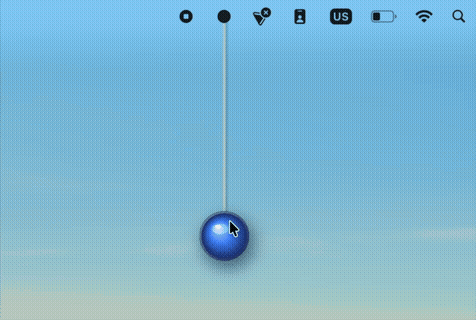

# FidgetBall

macOS status bar fidget toy for ADHD focus. A physics-simulated ball hangs from your menu bar on a rope — drag it, throw it, watch it bounce.



## Features

- Pendulum ball on a Verlet-integrated particle rope anchored to the status bar
- Throw the ball to snap the rope — free-ball mode with screen-edge bouncing
- Click-through overlay: the window never intercepts your mouse outside the ball
- Global hotkey to show/hide (no Accessibility permission needed)
- Settings: rope length, gravity, damping, ball size, color, break threshold

## Requirements

- macOS 14+
- Xcode Command Line Tools (`xcode-select --install`)

## Build & Run

```bash
bash build.sh
open FidgetBall.app
```

No Xcode project. Pure `swiftc` multi-file build with ad-hoc codesign for local launch.

## Architecture

| Component | Role |
|---|---|
| `BallSettings` | Single source of truth; reads/writes `UserDefaults`; posts `BallSettings.changed` on mutation |
| `BallView` | Verlet particle chain physics; observes settings; handles drag/throw/bounce |
| `AppDelegate` | Owns the full-screen `NSPanel` overlay and status bar button |
| `HotkeyManager` | Carbon `RegisterEventHotKey` for system-wide toggle shortcut |
| `SettingsWindowController` | Singleton settings window with sliders, color wells, shortcut recorder |

## Adding Source Files

Add the `.swift` file path to the `swiftc` invocation in `build.sh`. Add `-framework Name` there too for new frameworks.
